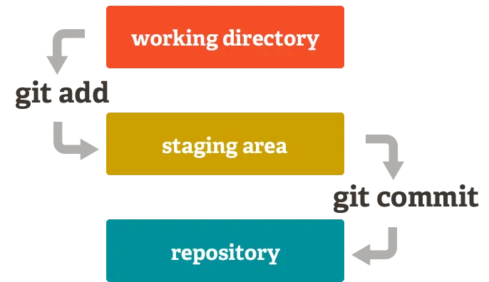

Dieses Dokument behandelt die grundlegenden Git-Befehle, die du benötigst, um mit Git zu arbeiten. Es ist eine Einführung in die wichtigsten Konzepte und Befehle von Git, damit du schnell loslegen kannst. Folgende Befehle werden behandelt: init, clone, status, add, commit und log.

Anmerkung: Dieser Text übernimmt Ausschnitte aus dem Buch "Pro Git" von Scott Chacon und Ben Straub, das unter der [Creative Commons Attribution-NonCommercial-ShareAlike 3.0 Unported License](https://creativecommons.org/licenses/by-nc-sa/3.0/) veröffentlicht wurde. Das ganze Buch ist [online verfügbar](https://git-scm.com/book/de/v2).


# git Repositorys anlegen

Du hast zwei Möglichkeiten, ein Git-Repository auf Deinem Rechner anzulegen.

- Du kannst ein lokales Verzeichnis, das sich derzeit nicht unter Versionskontrolle befindet, in ein Git-Repository verwandeln, oder

- Du kannst ein bestehendes Git-Repository von einem anderen Ort aus klonen.

In beiden Fällen erhältst Du ein einsatzbereites Git-Repository auf Deinem lokalen Rechner.

## Ein Repository in einem bestehenden Verzeichnis einrichten

Wenn Du ein Projektverzeichnis hast, das sich derzeit nicht unter Versionskontrolle befindet, und Du mit dessen Versionierung über Git beginnen möchten, musst Du zunächst in das Verzeichnis dieses Projekts wechseln. Das sieht je nachdem, welches System verwendet wird, unterschiedlich aus:

für Linux:

```bash
$ cd /home/user/my_project
```

für macOS:

```bash
$ cd /Users/user/my_project
```

für Windows:

```bash
$ cd C:/Users/user/my_project
```

Führe dort folgenden Befehl aus:

```bash
$ git init
```
Der Befehl `git init` erzeugt ein Unterverzeichnis .git, in dem alle relevanten Git-Repository-Daten enthalten sind, also so etwas wie ein Git-Repository Grundgerüst. Zu diesem Zeitpunkt werden noch keine Dateien in Git versioniert. 

Wenn Du bereits existierende Dateien versionieren möchtest (und es sich nicht nur um ein leeres Verzeichnis handelt), dann solltest Du den aktuellen Stand mit einem initialen Commit tracken. Mit dem Befehl `git add` legst Du fest, welche Dateien versioniert werden sollen und mit dem Befehl `git commit` erzeugst Du einen neuen Commit: Du kannst dies mit ein paar git add-Befehlen erreichen. Damit markierst du die zu trackende Dateien. Anschließend gibst du ein git commit ein:

```bash
$ git add *.c
$ git add LICENSE
$ git commit -m 'Initial project version'
```

Wir werden gleich noch einmal genauer auf diese Befehle eingehen. Im Moment ist nur wichtig zu verstehen, dass du jetzt ein Git-Repository erzeugt und einen ersten Commit angelegt hast.

## Ein existierendes Repository klonen

Wenn du eine Kopie eines existierenden Git-Repositorys anlegen möchtest – um beispielsweise an einem Projekt mitzuarbeiten – kannst du den Befehl `git clone` verwenden. Anstatt nur eine einfache Arbeitskopie vom Projekt zu erzeugen, lädt Git nahezu alle Daten, die der Server bereithält, auf den lokalen Rechner. Jede Version von jeder Datei der Projekt-Historie wird automatisch heruntergeladen, wenn du `git clone` ausführst. Wenn deine Serverfestplatte beschädigt wird, kannst du nahezu jeden der Klone auf irgendeinem Client verwenden, um den Server wieder in den Zustand zurückzusetzen, in dem er sich zum Zeitpunkt des Klonens befand.

Du klonst ein Repository mit dem Befehl `git clone [url]`. Um beispielsweise das Repository der verlinkbaren Git-Bibliothek libgit2 zu klonen, führst du folgenden Befehl aus:

```bash
$ git clone https://github.com/libgit2/libgit2
```

Git legt dann ein Verzeichnis libgit2 an, initialisiert in diesem ein .git Verzeichnis, lädt alle Daten des Repositorys herunter und checkt eine Kopie der aktuellsten Version aus. Wenn du in das neue libgit2 Verzeichnis wechselst, findest du dort die Projektdateien und kannst gleich damit arbeiten.

Wenn du das Repository in ein Verzeichnis mit einem anderen Namen als libgit2 klonen möchtest, kannst du das wie folgt durchführen:

```bash
$ git clone https://github.com/libgit2/libgit2 mylibgit
```

Dieser Befehl tut das Gleiche wie der vorhergehende, aber das Zielverzeichnis lautet diesmal mylibgit.

Git unterstützt eine Reihe unterschiedlicher Übertragungsprotokolle. Das vorhergehende Beispiel verwendet das https:// Protokoll, aber dir könnten auch die Angaben git:// oder user@server:path/to/repo.git begegnen, welches das SSH-Transfer-Protokoll verwendet. Kapitel 4, Git auf dem Server, stellt alle verfügbaren Optionen vor, die der Server für den Zugriff auf dein Git-Repository hat und die Vor- und Nachteile der möglichen Optionen.


# Die drei Zustände

Jetzt heißt es aufgepasst! Es folgt die wichtigste Information, die man sich merken muss, wenn man Git erlernen und dabei Fallstricke vermeiden will. Git definiert drei Hauptzustände, in denen sich eine Datei befinden kann: geändert (engl. modified), für Commit vorgemerkt (engl. staged) und committet (engl. committed).

- **Modified** bedeutet, dass eine Datei geändert, aber noch nicht in die lokale Datenbank eingecheckt wurde.

- **Staged** bedeutet, dass eine geänderte Datei in ihrem gegenwärtigen Zustand für den nächsten Commit vorgemerkt ist.

- **Committed** bedeutet, dass die Daten sicher in der lokalen Datenbank gespeichert sind.

Das führt uns zu den drei Hauptbereichen eines Git-Projekts: dem Verzeichnisbaum (engl. Working Tree), der sogenannten Staging-Area und dem Git-Verzeichnis.



Der Verzeichnisbaum ist ist die aktuelle "Arbeitskopie", die du verwendest und Dateien änderst, hinzufügst oder löscht.

Die Staging-Area ist in der Regel eine Datei, die sich in deinem Git-Verzeichnis befindet und Informationen darüber speichert, was in deinem nächsten Commit einfließen soll.

Im Git-Verzeichnis werden die Metadaten und die Objektdatenbank für dein Projekt gespeichert. Das ist der wichtigste Teil von Git, dieser Teil wird kopiert, wenn man ein Repository von einem anderen Rechner klont.

Der grundlegende Git-Arbeitsablauf sieht in etwa so aus:

- Du änderst Dateien in deinem Verzeichnisbaum.

- Du stellst selektiv Änderungen bereit, die du bei deinem nächsten Commit berücksichtigen möchtest, wodurch nur diese Änderungen in den Staging-Bereich aufgenommen werden.

- Du führst einen Commit aus, der die Dateien so übernimmt, wie sie sich in der Staging-Area befinden und diesen Snapshot dauerhaft in deinem Git-Verzeichnis speichert.

Wenn sich eine bestimmte Version einer Datei im Git-Verzeichnis befindet, wird sie als committed betrachtet. Wenn sie geändert und in die Staging-Area hinzugefügt wurde, gilt sie als für den Commit vorgemerkt (engl. staged). Und wenn sie geändert, aber noch nicht zur Staging-Area hinzugefügt wurde, gilt sie als geändert (engl. modified). 


# Zustand von Dateien prüfen

Das wichtigste Hilfsmittel, um den Zustand zu überprüfen, in dem sich deine Dateien gerade befinden, ist der Befehl `git status`. Wenn du diesen Befehl unmittelbar nach dem Klonen eines Repositorys ausführen, sollte er in etwa folgende Ausgabe liefern:

```bash
$ git status
On branch master
Your branch is up-to-date with 'origin/master'.
nothing to commit, working tree clean
```

Dieser Zustand wird auch als sauberes Arbeitsverzeichnis (engl. clean working directory) bezeichnet. Mit anderen Worten, es gibt keine Dateien, die unter Versionsverwaltung stehen und seit dem letzten Commit geändert wurden – andernfalls würden sie hier aufgelistet werden. 

Nehmen wir einmal an, du fügst eine neue Datei mit dem Namen `README` zu deinem Projekt hinzu. Wenn die Datei zuvor nicht existiert hat und du jetzt `git status` ausführst, zeigt Git die bisher nicht versionierte Datei wie folgt an:

```bash
$ echo 'My Project' > README
$ git status
On branch master
Your branch is up-to-date with 'origin/master'.
Untracked files:
  (use "git add <file>..." to include in what will be committed)

    README

nothing added to commit but untracked files present (use "git add" to track)
```

Alle Dateien, die im Abschnitt „Untracked files“ aufgelistet werden, sind Dateien, die bisher noch nicht versioniert sind. Dort wird jetzt auch die Datei `README` angezeigt. Mit anderen Worten, die Datei `README` wird in diesem Bereich gelistet, weil sie im letzten Schnappschuss nicht enthalten war und noch nicht gestaged wurde. Git nimmt eine solche Datei nicht automatisch in die Versionsverwaltung auf. Du musst Git dazu ausdrücklich auffordern. Ansonsten würden generierte Binärdateien oder andere Dateien, die du nicht in deinem Repository haben möchtest, automatisch hinzugefügt werden. Das möchte man in den meisten Fällen vermeiden. Jetzt wollen wir aber Änderungen an der Datei README verfolgen und fügen sie deshalb zur Versionsverwaltung hinzu.

# Neue und geänderte Dateien zur Staging-Area hinzufügen

## Neue Dateien zur Versionsverwaltung hinzufügen

Um eine neue Datei zu versionieren, kannst du den Befehl `git add` verwenden. Für eine neue `README` Datei, kannst du folgendes ausführen:

```bash
$ git add README
```

Wenn du erneut den Befehl `git status` ausführst, wirst du sehen, dass sich deine `README` Datei jetzt unter Versionsverwaltung befindet und für den nächsten Commit vorgemerkt ist:

```bash
$ git status
On branch master
Your branch is up-to-date with 'origin/master'.
Changes to be committed:
  (use "git restore --staged <file>..." to unstage)

    new file:   README
```

Du kannst erkennen, dass die Datei für den nächsten Commit vorgemerkt ist, weil sie unter der Rubrik „Changes to be committed“ aufgelistet ist. Wenn du jetzt einen Commit anlegst, wird der Schnappschuss den Zustand der Datei festhalten, den sie zum **Zeitpunkt des Befehls**  `git add` hat. Du erinnerst dich vielleicht daran, wie du vorhin `git init` und anschließend `git add <files>` ausgeführt hast. Mit diesen Befehlen hast du die Dateien in deinem Verzeichnis zur Versionsverwaltung hinzugefügt. Der Befehl `git add` akzeptiert einen Pfadnamen einer Datei oder eines Verzeichnisses. Wenn du ein Verzeichnis angibst, fügt `git add` alle Dateien in diesem Verzeichnis und allen Unterverzeichnissen rekursiv hinzu.


## Geänderte Dateien zur Staging-Area hinzufügen

Lass uns jetzt eine bereits versionierte Datei ändern. Wenn du zum Beispiel eine bereits unter Versionsverwaltung stehende Datei mit dem Dateinamen `CONTRIBUTING.md` änderst und danach den Befehl `git status` erneut ausführst, erhältst du in etwa folgende Ausgabe:

```bash
$ vim CONTRIBUTING.md
$ git status
On branch master
Your branch is up-to-date with 'origin/master'.
Changes to be committed:
  (use "git reset HEAD <file>..." to unstage)

    new file:   README

Changes not staged for commit:
  (use "git add <file>..." to update what will be committed)
  (use "git checkout -- <file>..." to discard changes in working directory)

    modified:   CONTRIBUTING.md
```

Die Datei `CONTRIBUTING.md` erscheint im Abschnitt „Changes not staged for commit“. Das bedeutet, dass eine versionierte Datei im Arbeitsverzeichnis verändert worden ist, aber noch nicht für den Commit vorgemerkt wurde. Um sie vorzumerken, führst du den Befehl `git add` aus. Der Befehl `git add` wird zu vielen verschiedenen Zwecken eingesetzt. Man verwendet ihn, um neue Dateien zur Versionsverwaltung hinzuzufügen, Dateien für einen Commit vorzumerken und verschiedene andere Dinge – beispielsweise einen Konflikt aus einem Merge als aufgelöst zu kennzeichnen. Leider wird der Befehl `git add` oft missverstanden. Viele assoziieren damit, dass damit Dateien zum Projekt hinzugefügt werden. Wie du aber gerade gelernt hast, wird der Befehl auch noch für viele andere Dinge eingesetzt. Wenn du den Befehl `git add` einsetzt, solltest du das eher so sehen, dass du damit einen bestimmten Inhalt für **den nächsten Commit vormerkst**. Lass uns nun mit `git add` die Datei `CONTRIBUTING.md` zur Staging-Area hinzufügen und danach das Ergebnis mit git status kontrollieren:

```bash
$ git add CONTRIBUTING.md
$ git status
On branch master
Your branch is up-to-date with 'origin/master'.
Changes to be committed:
  (use "git reset HEAD <file>..." to unstage)

    new file:   README
    modified:   CONTRIBUTING.md
```

Beide Dateien sind nun für den nächsten Commit vorgemerkt. Nehmen wir an, du willst jetzt aber noch eine weitere Änderung an der Datei `CONTRIBUTING.md` vornehmen, bevor du den Commit tatsächlich startest. Du öffnest die Datei erneut, änderst sie entsprechend ab und eigentlich wärst du jetzt bereit den Commit durchzuführen. Lass uns vorher noch einmal den Befehl git status ausführen:

```bash
$ git status
On branch master
Your branch is up-to-date with 'origin/master'.
Changes to be committed:
  (use "git reset HEAD <file>..." to unstage)

    new file:   README
    modified:   CONTRIBUTING.md

Changes not staged for commit:
  (use "git add <file>..." to update what will be committed)
  (use "git checkout -- <file>..." to discard changes in working directory)

    modified:   CONTRIBUTING.md
```

Was zum Kuckuck …​? Jetzt wird die Datei `CONTRIBUTING.md` sowohl in der Staging-Area als auch als geändert aufgelistet. Wie ist das möglich? Die Erklärung dafür ist, dass Git eine Datei in exakt dem Zustand für den Commit vormerkt, in dem sie sich befindet, wenn du den Befehl `git add` ausführst. Wenn du den Commit jetzt anlegst, wird die Version der Datei `CONTRIBUTING.md` denjenigen Inhalt haben, den sie hatte, als du `git add` zuletzt ausgeführt hast und nicht denjenigen, den sie in dem Moment hat, wenn du den Befehl `git commit` ausführst. Wenn du stattdessen die gegenwärtige Version im Commit haben möchten, müsst du erneut `git add` ausführen, um die Datei der Staging-Area hinzuzufügen:

```bash 
$ git add CONTRIBUTING.md
$ git status
On branch master
Your branch is up-to-date with 'origin/master'.
Changes to be committed:
  (use "git reset HEAD <file>..." to unstage)

    new file:   README
    modified:   CONTRIBUTING.md
```

# Die Änderungen committen

Nachdem deine Staging-Area nun so eingerichtet ist, wie du es wünschst, kannst du deine Änderungen committen. Denke daran, dass alles, was noch nicht zum Commit vorgemerkt ist – alle Dateien, die du erstellt oder geändert hast und für die du seit deiner Bearbeitung nicht mehr git add ausgeführt hast – nicht in diesen Commit einfließen werden. Sie bleiben aber als geänderte Dateien auf deiner Festplatte erhalten. In diesem Beispiel nehmen wir an, dass du beim letzten Mal, als du `git status` ausgeführt hast, gesehen hast, dass alles zum Commit vorgemerkt wurde und du bereit bist, alle deine Änderungen zu committen. Am einfachsten committen man, wenn `git commit` eingegeben wird:

```bash
$ git commit
```

Dadurch wird der Editor deiner Wahl gestartet.

Anmerkung: Der Editor wird durch die Umgebungsvariable EDITOR deiner Shell festgelegt. Du kannst den Editor aber auch mit dem Befehl `git config --global core.editor` beliebig konfigurieren.

Der Editor zeigt den folgenden Text an (dieses Beispiel ist eine Vim-Ansicht):

```bash

# Please enter the commit message for your changes. Lines starting
# with '#' will be ignored, and an empty message aborts the commit.
# On branch master
# Your branch is up-to-date with 'origin/master'.
#
# Changes to be committed:
#	new file:   README
#	modified:   CONTRIBUTING.md
#
~
~
~
".git/COMMIT_EDITMSG" 9L, 283C
```

Du kannst erkennen, dass die Standard-Commit-Meldung die neueste Ausgabe des Befehls `git status` auskommentiert und eine leere Zeile darüber enthält. Du kannst über den Kommentartext eine Commit-Nachricht eingeben, die beschreibt, was du geändert hast.

Alternativ kannst du deine Commit-Nachricht auch inline mit dem Befehl `commit -m` eingeben. Das Flag `-m` ermöglicht die direkte Eingabe eines Kommentartextes:

```bash
$ git commit -m "Story 182: fix benchmarks for speed"
[master 463dc4f] Story 182: fix benchmarks for speed
 2 files changed, 2 insertions(+)
 create mode 100644 README
```

Jetzt hast du deinen ersten Commit erstellt! Du kannst sehen, dass der Commit eine Nachricht über sich selbst ausgegeben hat: in welchen Branch du committet hast (master), welche SHA-1-Prüfsumme der Commit hat (463dc4f), wie viele Dateien geändert wurden und Statistiken über hinzugefügte und entfernte Zeilen im Commit.

Denke daran, dass der Commit den Snapshot aufzeichnet, den du in deiner Staging-Area eingerichtet hast. Alles, was von dir nicht zum Commit vorgemerkt wurde, ist weiterhin verfügbar. Du kannst einen weiteren Commit durchführen, um es zu deiner Historie hinzuzufügen. Jedes Mal, wenn du einen Commit ausführst, zeichnest du einen Schnappschuss deines Projekts auf, auf den du zurückgreifen oder mit dem du später vergleichen kannst.

## Die Staging-Area überspringen

Obwohl es außerordentlich nützlich sein kann, Commits so zu erstellen, wie du es wünschst, ist die Staging-Area manchmal etwas komplexer, als du es für deinen Workflow benötigst. Wenn du die Staging-Area überspringen möchten, bietet Git eine einfache Kurzform. Durch das Hinzufügen der Option `-a` zum Befehl `git commit` wird jede Datei, die bereits vor dem Commit versioniert war, automatisch von Git zum Commit staged, so dass du den Teil `git add` überspringen kannst:

```bash
$ git status
On branch master
Your branch is up-to-date with 'origin/master'.
Changes not staged for commit:
  (use "git add <file>..." to update what will be committed)
  (use "git checkout -- <file>..." to discard changes in working directory)

    modified:   CONTRIBUTING.md

no changes added to commit (use "git add" and/or "git commit -a")

$ git commit -a -m 'Add new benchmarks'
[master 83e38c7] Add new benchmarks
 1 file changed, 5 insertions(+), 0 deletions(-)
```

Beachte, dass du in diesem Fall `git add` nicht für die Datei `CONTRIBUTING.md` ausführen musst, bevor du committest. Das liegt daran, dass das `-a`-Flag alle geänderten Dateien einschließt. Das ist bequem. Aber sei vorsichtig, manchmal führt dieses Flag dazu, dass du ungewollte Änderungen vornimmst.

# Anzeigen der Commit-Historie

Nachdem du mehrere Commits erstellt hast, oder wenn du ein Repository mit einer bestehenden Commit-Historie geklont hast, wirst du wahrscheinlich zurückschauen wollen, um zu erfahren, was geschehen ist. Das wichtigste und mächtigste Werkzeug dafür ist der Befehl `git log`.

Diese Beispiele verwenden ein sehr einfaches Projekt namens „simplegit“. Um das Projekt zu erstellen, führe diesen Befehl aus:

`$ git clone https://github.com/schacon/simplegit-progit`

Wenn du `git log` in diesem Projekt aufrufst, solltest du eine Ausgabe erhalten, die ungefähr so aussieht:

```bash
$ git log
commit ca82a6dff817ec66f44342007202690a93763949
Author: Scott Chacon <schacon@gee-mail.com>
Date:   Mon Mar 17 21:52:11 2008 -0700

    Change version number

commit 085bb3bcb608e1e8451d4b2432f8ecbe6306e7e7
Author: Scott Chacon <schacon@gee-mail.com>
Date:   Sat Mar 15 16:40:33 2008 -0700

    Remove unnecessary test

commit a11bef06a3f659402fe7563abf99ad00de2209e6
Author: Scott Chacon <schacon@gee-mail.com>
Date:   Sat Mar 15 10:31:28 2008 -0700

    Initial commit
```

Standardmäßig, d.h. ohne Argumente, listet `git log` die in diesem Repository vorgenommenen Commits in umgekehrter chronologischer Reihenfolge auf, d.h. die **neuesten Commits werden als Erstes** angezeigt. Wie du sehen kannst, listet dieser Befehl jeden Commit mit seiner SHA-1-Prüfsumme, dem Namen und der E-Mail-Adresse des Autors, dem Erstellungs-Datum und der Commit-Beschreibung auf.

Eine Vielzahl von Optionen stehen für den Befehl `git log` zur Verfügung, um dir exakt das anzuzeigen, wonach du suchst. Hier zeigen wir dir einige der gängigsten.

Eine der hilfreichsten Optionen ist `-p` oder `--patch`. Sie zeigt die Änderungen (die patch-Ausgabe) an, die bei jedem Commit durchgeführt wurden. Du kannst auch die Anzahl der anzuzeigenden Protokolleinträge begrenzen, z.B. mit `-2` werden nur die letzten beiden Einträge dargestellt.

```bash
$ git log -p -2
commit ca82a6dff817ec66f44342007202690a93763949
Author: Scott Chacon <schacon@gee-mail.com>
Date:   Mon Mar 17 21:52:11 2008 -0700

    Change version number

diff --git a/Rakefile b/Rakefile
index a874b73..8f94139 100644
--- a/Rakefile
+++ b/Rakefile
@@ -5,7 +5,7 @@ require 'rake/gempackagetask'
 spec = Gem::Specification.new do |s|
     s.platform  =   Gem::Platform::RUBY
     s.name      =   "simplegit"
-    s.version   =   "0.1.0"
+    s.version   =   "0.1.1"
     s.author    =   "Scott Chacon"
     s.email     =   "schacon@gee-mail.com"
     s.summary   =   "A simple gem for using Git in Ruby code."

commit 085bb3bcb608e1e8451d4b2432f8ecbe6306e7e7
Author: Scott Chacon <schacon@gee-mail.com>
Date:   Sat Mar 15 16:40:33 2008 -0700

    Remove unnecessary test

diff --git a/lib/simplegit.rb b/lib/simplegit.rb
index a0a60ae..47c6340 100644
--- a/lib/simplegit.rb
+++ b/lib/simplegit.rb
@@ -18,8 +18,3 @@ class SimpleGit
     end

 end
-
-if $0 == __FILE__
-  git = SimpleGit.new
-  puts git.show
-end
```
Diese Option zeigt die gleichen Informationen an, jedoch mit der diff Ausgabe direkt nach jedem Eintrag. Dies ist sehr hilfreich für die Codeüberprüfung oder um schnell zu durchsuchen, was während einer Reihe von Commits passiert ist, die ein Teammitglied hinzugefügt hat. Du kannst auch mehrere Optionen zur Verdichtung der Ausgabe von git log verwenden. Wenn du beispielsweise einige gekürzte Statistiken für jeden Commit sehen möchtest, kannst du die Option `--stat` verwenden:

```bash
$ git log --stat
commit ca82a6dff817ec66f44342007202690a93763949
Author: Scott Chacon <schacon@gee-mail.com>
Date:   Mon Mar 17 21:52:11 2008 -0700

    Change version number

 Rakefile | 2 +-
 1 file changed, 1 insertion(+), 1 deletion(-)

commit 085bb3bcb608e1e8451d4b2432f8ecbe6306e7e7
Author: Scott Chacon <schacon@gee-mail.com>
Date:   Sat Mar 15 16:40:33 2008 -0700

    Remove unnecessary test

 lib/simplegit.rb | 5 -----
 1 file changed, 5 deletions(-)

commit a11bef06a3f659402fe7563abf99ad00de2209e6
Author: Scott Chacon <schacon@gee-mail.com>
Date:   Sat Mar 15 10:31:28 2008 -0700

    Initial commit

 README           |  6 ++++++
 Rakefile         | 23 +++++++++++++++++++++++
 lib/simplegit.rb | 25 +++++++++++++++++++++++++
 3 files changed, 54 insertions(+)
```

Wie du sehen kannst, gibt die Option `--stat` unter jedem Commit-Eintrag eine Liste der geänderten Dateien aus, wie viele Dateien geändert wurden und wie viele Zeilen in diesen Dateien hinzugefügt (+) und entfernt wurden (-). Sie enthält auch eine Zusammenfassung am Ende des Berichts.

Eine weitere wirklich nützliche Option ist `--pretty`. Diese Option ändert das Format der Log-Ausgabe in ein anderes als das Standard-Format. Dir stehen einige vorgefertigte Optionswerte zur Verfügung. Der Wert oneline für diese Option gibt jeden Commit in einer einzigen Zeile aus, was besonders nützlich ist, wenn du dir viele Commits ansiehst. Darüber hinaus zeigen die Werte short, full und fuller die Ausgabe im etwa gleichen Format, allerdings mit mehr oder weniger Informationen an:

```bash
$ git log --pretty=oneline
ca82a6dff817ec66f44342007202690a93763949 Change version number
085bb3bcb608e1e8451d4b2432f8ecbe6306e7e7 Remove unnecessary test
a11bef06a3f659402fe7563abf99ad00de2209e6 Initial commit
```


